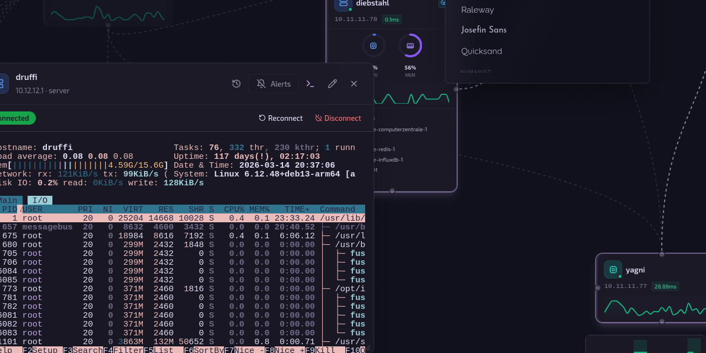

# Computerzentrale

[](https://nodejs.org/)
[](https://www.typescriptlang.org/)
[](https://reactjs.org/)
[](LICENSE)

<div align="center">
  
</div>

a beautiful webapp for visualizing, managing and monitoring computers. does everything via ssh, so kinda agentless. built-in terminal everywhere. made to flex to ur wife with dark mode only. great starting point if you plan a computer operation of any kind, works and looks good. very stable. trust the hatsune miku cursor guy.


clone the repo, execute `./scripts/setup.sh`, `docker-compose up -d` and you are good to go.

navigate to http://localhost:3001, login, go to settings and add the private ssh key you want the app to connect with. start adding nodes.

i would not recommend putting this in the internet, but each to their own. in germany we say "ist mir wurst"

<div align="center">
  <video src="https://github.com/user-attachments/assets/8d2619c3-7086-468c-98e4-259e11556967" width="100%" autoplay loop muted playsinline></video>
</div>

## Features

- **Visual Network Canvas** — Interactive drag-and-drop topology map powered by React Flow
- **Real-time Monitoring** — ICMP ping every 10s with live status via WebSocket
- **Server Metrics** — CPU, memory, disk, network collected over SSH, stored in InfluxDB
- **SSH Terminal** — In-browser terminal access to any server node
- **Docker Management** — Start, stop, restart containers with live log streaming
- **Reverse Proxy** — View and manage nginx proxy configurations
- **WireGuard VPN** — Monitor peers, transfer stats, generate client configs
- **Telegram Alerts** — Per-node online/offline notifications via Telegram bot
- **35 Dark Themes** — Terminal-inspired palettes (Dracula, Nord, Tokyo Night, Catppuccin, etc.)
- **26 Fonts** — From geometric (Jost, Outfit) to monospace (JetBrains Mono, Fira Code)
- **Fully Agentless** — Zero software installation on monitored nodes. Everything over SSH + ICMP.

### Agentless Architecture

| Function | Method | Requires SSH? |
|----------|--------|---------------|
| Ping monitoring | ICMP ping | No |
| Server metrics (CPU, memory, disk, network) | SSH commands → InfluxDB | Yes |
| Docker management | SSH → `docker` CLI | Yes |
| Reverse proxy | SSH → nginx config parsing | Yes |
| WireGuard VPN | SSH → `wg show` | Yes |
| SSH terminal | Direct SSH via WebSocket | Yes |

## Tech Stack

| Layer | Technologies |
|-------|-------------|
| **Frontend** | React 18, TypeScript, Vite, React Flow, Zustand, Tailwind CSS, shadcn/ui, Tremor charts, xterm.js |
| **Backend** | Node.js, Express, TypeScript, SQLite, Drizzle ORM, WebSocket (ws), ssh2 |
| **Data** | SQLite (config), InfluxDB (time series), Redis (SSH result caching) |
| **Infra** | Docker, Docker Compose |

## Quick Start

### Prerequisites

- **Node.js** 20+
- **Docker** and **Docker Compose** (for Redis + InfluxDB)

### Setup

```bash
git clone https://github.com/Construct-OS/privatzentrale.git
cd privatzentrale

# Generate secrets and configure environment
./scripts/setup.sh

# Start with Docker (recommended)
docker compose up -d

# Or run locally for development
npm install
npm run db:migrate
npm run dev
```

The setup script generates all required secrets (`ENCRYPTION_SECRET`, `INFLUXDB_TOKEN`, `INFLUXDB_ADMIN_PASSWORD`) and writes `.env` files automatically.

### Access

- **App**: http://localhost:3001
- **Dev frontend**: http://localhost:5173 (proxies API to backend)

## Configuration

### Environment Variables

| Variable | Required | Default | Description |
|----------|----------|---------|-------------|
| `ENCRYPTION_SECRET` | **Yes** | Auto-generated | 256-bit key for SSH key encryption and JWT tokens |
| `APP_PASSWORD` | No | *(disabled)* | Password-protect the web interface |
| `INFLUXDB_URL` | No | `http://localhost:8086` | InfluxDB server URL |
| `INFLUXDB_TOKEN` | No | Auto-generated | InfluxDB API token |
| `INFLUXDB_ORG` | No | `computerzentrale` | InfluxDB organization |
| `INFLUXDB_BUCKET` | No | `ping_metrics` | InfluxDB bucket |
| `REDIS_URL` | No | `redis://localhost:6379` | Redis connection URL |
| `PORT` | No | `3001` | Server port |
| `SERVER_METRICS_INTERVAL` | No | `10` | Metrics collection interval (seconds) |

> **Note:** Run `./scripts/setup.sh` to generate all secrets automatically. Never commit `.env` files.

## Security

### SSH Key Encryption

SSH private keys are encrypted at rest using **AES-256-GCM** with PBKDF2 key derivation (SHA-512, 100,000 iterations). Each encryption uses a unique random salt (64 bytes) and IV (16 bytes).

### Authentication

When `APP_PASSWORD` is set, the web interface requires authentication. Sessions use JWT tokens signed with `ENCRYPTION_SECRET`. If the secret is not set, an ephemeral key is generated on startup (sessions won't survive restarts).

## Architecture

### Real-time Data Flow

```
Backend (10s interval)
  ├── Ping all nodes → SQLite + InfluxDB + WebSocket broadcast
  └── SSH server metrics → InfluxDB + WebSocket broadcast

Frontend
  └── WebSocket → Zustand stores → React components re-render
```

Both ping results and server metrics are pushed via WebSocket — no polling for live data. Historical time-series data (charts, uptime) fetches from InfluxDB API with client-side caching.

### Project Structure

```
privatzentrale/
├── frontend/                 # React + Vite + TypeScript
│   └── src/
│       ├── components/       # UI components (Canvas, Sidebar, Modals, etc.)
│       ├── pages/            # Dashboard, Nodes, Management, Settings
│       ├── stores/           # Zustand stores (infra, metrics, theme, management)
│       ├── hooks/            # WebSocket, URL params, terminal
│       ├── lib/              # Themes (35), fonts (26), utilities
│       └── types/            # Shared TypeScript types
│
├── backend/                  # Express + TypeScript
│   └── src/
│       ├── controllers/      # Request handlers
│       ├── services/         # Monitoring, SSH, metrics, alerting, encryption
│       ├── database/         # Drizzle ORM schema + migrations
│       ├── middleware/       # Auth, error handling
│       └── routes/           # API routes
│
├── scripts/
│   └── setup.sh              # Interactive setup script
├── docker-compose.yml         # App + Redis + InfluxDB
├── Dockerfile                 # Multi-stage production build
└── CLAUDE.md                  # AI assistant context
```

## Development

```bash
# Start both frontend and backend with hot reload
npm run dev

# Build for production
npm run build

# Database migrations
npm run db:generate    # Generate from schema changes
npm run db:migrate     # Apply migrations
```

## Docker

```bash
# Start everything (app + Redis + InfluxDB)
docker compose up -d

# View logs
docker compose logs -f computerzentrale

# Stop
docker compose down
```

The Docker setup uses a multi-stage build (deps → builder → runner) on `node:20-alpine` with health checks.

## API

### REST Endpoints

| Resource | Endpoints |
|----------|-----------|
| **Nodes** | `GET/POST /api/nodes`, `PATCH/DELETE /api/nodes/:id` |
| **Edges** | `GET/POST /api/edges`, `DELETE /api/edges/:id` |
| **Monitoring** | `GET/PUT /api/monitoring/settings`, `POST /api/monitoring/check` |
| **Docker** | `GET /api/docker/hosts`, `GET /api/docker/:id/containers`, `POST .../start\|stop\|restart` |
| **Reverse Proxy** | `GET /api/reverse-proxy/:id/configs` |
| **WireGuard** | `GET /api/wireguard/:id/status` |
| **Metrics** | `GET /api/metrics/:id/history\|uptime\|server\|server/latest` |
| **Alerting** | `GET/POST /api/alerting/telegram/config`, `GET /api/alerting/events` |
| **Health** | `GET /api/health` |

### WebSocket Events

| Event | Direction | Description |
|-------|-----------|-------------|
| `ping_results` | Server → Client | Ping status for all nodes (every 10s) |
| `server_metrics` | Server → Client | CPU/memory/disk/network for servers (every 10s) |
| `node_update` | Server → Client | Node configuration changed |
| `container_action` | Server → Client | Docker container action result |
| `terminal_output` | Server → Client | SSH terminal data |
| `terminal_input` | Client → Server | SSH terminal keystrokes |

## Contributing

contributions are only welcome if they are good. prepare to be yelled at if you want to contribute.

## License

MIT — see [LICENSE](LICENSE) for details.

---

<p align="center">made with real love for computers in schleswig holstein</p>
